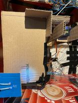

# SPB - SMART PIGGY BANK

Проектът представлява автоматично брояща касичка. Състои се от 2 основни компонента, а именно броене на стотинки и на хартиени пари. 

## Как се използва проектът?
За да използвате касичката е нужно тя да бъде включена. След като това се осъществи, единствената ваша работа е да ѝ давате стотинки или банкноти, които тя сама отброява.
 
# Документация

## Използвани технологии

* [Arduino Language](https://www.arduino.cc/reference/en/)

## Информация за авторите на проекта

* **Християн Радев**  - *изработил изцяло проекта - https://github.com/Hristiyyann*

## Снимки

### Рампата за отчитането на стотинки

### Плоскостта за отчитането на банкноти

### Снимки от екрана за различни валути

*Освен лева и евро, валутите са още долари и паундове*
